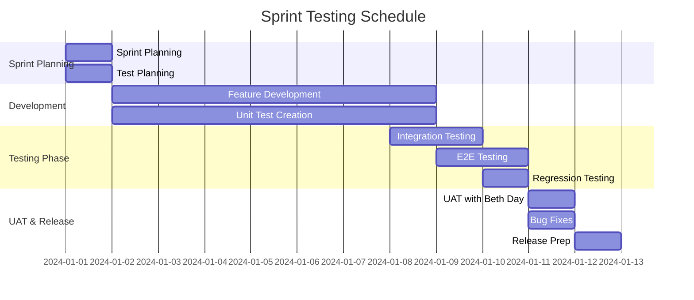

# 🧪 QA Testing Strategy - The Pink Blueberry Salon

## 📋 Executive Summary

This document outlines the comprehensive Quality Assurance testing strategy for The Pink Blueberry salon website, ensuring high-quality delivery through systematic testing approaches, automation excellence, and continuous quality improvement.

**QA Lead**: QA Expert
**Product Owner**: Beth Day
**Testing Framework**: Risk-based testing with automation-first approach
**Quality Target**: Zero critical defects, 80%+ code coverage, WCAG 2.1 AA compliance

---

## 🎯 Testing Objectives

### Primary Goals
1. **Reliability**: 99.9% uptime with zero critical defects in production
2. **Performance**: Sub-3s page loads on 3G, <500ms on WiFi
3. **Accessibility**: WCAG 2.1 AA compliance (100%)
4. **User Experience**: Seamless booking flow with <2% abandonment rate
5. **Cross-Platform**: Consistent experience across all devices/browsers

### Success Metrics
- ✅ Code Coverage: Minimum 80% (Target: 90%)
- ✅ Pass Rate: 95%+ for regression suites
- ✅ Defect Escape Rate: <5% to production
- ✅ Test Automation: 70% automated test coverage
- ✅ Performance: Core Web Vitals in green zone

---

## 🏗️ 1. Testing Framework Setup

### 1.1 Unit Testing (Jest + React Testing Library)

```javascript
// jest.config.js
module.exports = {
  preset: 'ts-jest',
  testEnvironment: 'jsdom',
  roots: ['<rootDir>/src'],
  setupFilesAfterEnv: ['<rootDir>/src/tests/setup.ts'],
  collectCoverageFrom: [
    'src/**/*.{ts,tsx}',
    '!src/**/*.d.ts',
    '!src/**/*.stories.tsx',
    '!src/**/index.ts'
  ],
  coverageThreshold: {
    global: {
      branches: 80,
      functions: 80,
      lines: 80,
      statements: 80
    }
  },
  moduleNameMapper: {
    '^@/(.*)$': '<rootDir>/src/$1',
    '\\.(css|less|scss|sass)$': 'identity-obj-proxy'
  },
  testMatch: [
    '**/__tests__/**/*.{ts,tsx}',
    '**/*.test.{ts,tsx}',
    '**/*.spec.{ts,tsx}'
  ]
};
```

### 1.2 Integration Testing (Testing Library + MSW)

```typescript
// src/tests/integration/booking.test.tsx
import { render, screen, waitFor } from '@testing-library/react';
import userEvent from '@testing-library/user-event';
import { rest } from 'msw';
import { setupServer } from 'msw/node';
import BookingFlow from '@/components/booking/BookingFlow';

const server = setupServer(
  rest.post('/api/appointments', (req, res, ctx) => {
    return res(ctx.json({ id: '123', status: 'confirmed' }));
  })
);

beforeAll(() => server.listen());
afterEach(() => server.resetHandlers());
afterAll(() => server.close());

describe('Booking Flow Integration', () => {
  it('completes full booking journey', async () => {
    const user = userEvent.setup();
    render(<BookingFlow />);

    // Service selection
    await user.click(screen.getByText('Hair Color'));
    await user.click(screen.getByText('Continue'));

    // Stylist selection
    await user.click(screen.getByText('Beth Day'));
    await user.click(screen.getByText('Continue'));

    // Date/Time selection
    await user.click(screen.getByText('December 15'));
    await user.click(screen.getByText('2:00 PM'));
    await user.click(screen.getByText('Continue'));

    // Contact info
    await user.type(screen.getByLabelText('Name'), 'Jane Doe');
    await user.type(screen.getByLabelText('Email'), 'jane@example.com');
    await user.type(screen.getByLabelText('Phone'), '555-0123');

    // Submit
    await user.click(screen.getByText('Book Appointment'));

    await waitFor(() => {
      expect(screen.getByText('Booking Confirmed!')).toBeInTheDocument();
    });
  });
});
```

### 1.3 E2E Testing (Playwright)

```typescript
// playwright.config.ts
import { defineConfig, devices } from '@playwright/test';

export default defineConfig({
  testDir: './tests/e2e',
  fullyParallel: true,
  forbidOnly: !!process.env.CI,
  retries: process.env.CI ? 2 : 0,
  workers: process.env.CI ? 1 : undefined,
  reporter: [
    ['html'],
    ['junit', { outputFile: 'test-results/junit.xml' }],
    ['json', { outputFile: 'test-results/results.json' }]
  ],
  use: {
    baseURL: 'http://localhost:3000',
    trace: 'on-first-retry',
    screenshot: 'only-on-failure',
    video: 'retain-on-failure'
  },
  projects: [
    {
      name: 'chromium',
      use: { ...devices['Desktop Chrome'] }
    },
    {
      name: 'firefox',
      use: { ...devices['Desktop Firefox'] }
    },
    {
      name: 'webkit',
      use: { ...devices['Desktop Safari'] }
    },
    {
      name: 'Mobile Chrome',
      use: { ...devices['Pixel 5'] }
    },
    {
      name: 'Mobile Safari',
      use: { ...devices['iPhone 13'] }
    }
  ],
  webServer: {
    command: 'npm run dev',
    url: 'http://localhost:3000',
    reuseExistingServer: !process.env.CI
  }
});
```

### 1.4 Performance Testing (Lighthouse CI + Artillery)

```yaml
# .lighthouserc.yml
ci:
  collect:
    url:
      - http://localhost:3000/
      - http://localhost:3000/services
      - http://localhost:3000/booking
      - http://localhost:3000/products
    numberOfRuns: 3
    settings:
      preset: desktop
      throttling:
        rttMs: 40
        throughputKbps: 10240
        cpuSlowdownMultiplier: 1
  assert:
    preset: lighthouse:recommended
    assertions:
      categories:performance: ["error", {"minScore": 0.9}]
      categories:accessibility: ["error", {"minScore": 0.95}]
      categories:best-practices: ["error", {"minScore": 0.9}]
      categories:seo: ["error", {"minScore": 0.9}]
      first-contentful-paint: ["error", {"maxNumericValue": 2000}]
      largest-contentful-paint: ["error", {"maxNumericValue": 2500}]
      cumulative-layout-shift: ["error", {"maxNumericValue": 0.1}]
      total-blocking-time: ["error", {"maxNumericValue": 300}]
```

### 1.5 Accessibility Testing (axe-core + Pa11y)

```typescript
// src/tests/accessibility/a11y.test.ts
import { test, expect } from '@playwright/test';
import AxeBuilder from '@axe-core/playwright';

const pages = [
  { name: 'Home', url: '/' },
  { name: 'Services', url: '/services' },
  { name: 'Booking', url: '/booking' },
  { name: 'Products', url: '/products' },
  { name: 'Contact', url: '/contact' }
];

pages.forEach(({ name, url }) => {
  test(`${name} page meets WCAG 2.1 AA standards`, async ({ page }) => {
    await page.goto(url);
    const accessibilityScanResults = await new AxeBuilder({ page })
      .withTags(['wcag2a', 'wcag2aa', 'wcag21a', 'wcag21aa'])
      .analyze();

    expect(accessibilityScanResults.violations).toEqual([]);
  });
});
```

---

## 📝 2. Test Scenarios for Critical Flows

### 2.1 Booking Appointment Flow

#### Happy Path Scenarios
```gherkin
Feature: Book Salon Appointment
  As a customer
  I want to book a salon appointment
  So that I can receive salon services

  Scenario: Successful appointment booking
    Given I am on the booking page
    When I select "Hair Color" service
    And I choose "Beth Day" as my stylist
    And I select "December 15, 2024" at "2:00 PM"
    And I enter valid contact information
    And I click "Book Appointment"
    Then I should see confirmation page
    And I should receive confirmation email
    And appointment should appear in stylist's calendar

  Scenario: Book multiple services
    Given I am on the booking page
    When I select multiple services:
      | Service     | Duration | Price |
      | Hair Color  | 2h       | $150  |
      | Hair Cut    | 45min    | $65   |
    And I continue through booking flow
    Then total duration should be "2h 45min"
    And total price should be "$215"
```

#### Edge Cases & Error Scenarios
```gherkin
  Scenario: Booking with unavailable time slot
    Given I am on date/time selection
    When I select a fully booked time slot
    Then I should see "This time is unavailable"
    And alternative times should be suggested

  Scenario: Invalid contact information
    Given I am on contact information step
    When I enter invalid email format
    Then I should see validation error
    And submit button should be disabled

  Scenario: Network failure during submission
    Given I have completed all booking steps
    When network connection fails during submission
    Then I should see retry option
    And form data should be preserved
```

### 2.2 Service Browsing & Selection

```typescript
// tests/e2e/services.spec.ts
import { test, expect } from '@playwright/test';

test.describe('Service Browsing', () => {
  test('filters services by category', async ({ page }) => {
    await page.goto('/services');

    // Check all services visible initially
    const allServices = page.locator('[data-testid="service-card"]');
    await expect(allServices).toHaveCount(12);

    // Filter by Hair category
    await page.click('[data-testid="category-hair"]');
    const hairServices = page.locator('[data-testid="service-card"]');
    await expect(hairServices).toHaveCount(6);

    // Verify filtered services
    const serviceTitles = await hairServices.allTextContents();
    serviceTitles.forEach(title => {
      expect(['Hair Cut', 'Hair Color', 'Highlights', 'Balayage', 'Hair Treatment', 'Blowout'])
        .toContain(title);
    });
  });

  test('displays service details on click', async ({ page }) => {
    await page.goto('/services');
    await page.click('text=Hair Color');

    await expect(page.locator('[data-testid="service-modal"]')).toBeVisible();
    await expect(page.locator('text=Full color service including consultation')).toBeVisible();
    await expect(page.locator('text=$150')).toBeVisible();
    await expect(page.locator('text=120 minutes')).toBeVisible();
  });
});
```

### 2.3 Contact Form Submission

```typescript
// tests/e2e/contact.spec.ts
test.describe('Contact Form', () => {
  test('submits contact inquiry successfully', async ({ page }) => {
    await page.goto('/contact');

    // Fill form
    await page.fill('[name="name"]', 'Jane Smith');
    await page.fill('[name="email"]', 'jane.smith@example.com');
    await page.fill('[name="phone"]', '555-0123');
    await page.selectOption('[name="subject"]', 'general');
    await page.fill('[name="message"]', 'I would like more information about your services.');

    // Submit
    await page.click('button[type="submit"]');

    // Verify success
    await expect(page.locator('text=Thank you for your message')).toBeVisible();
    await expect(page.locator('text=We will respond within 24 hours')).toBeVisible();
  });

  test('validates required fields', async ({ page }) => {
    await page.goto('/contact');
    await page.click('button[type="submit"]');

    await expect(page.locator('text=Name is required')).toBeVisible();
    await expect(page.locator('text=Email is required')).toBeVisible();
    await expect(page.locator('text=Message is required')).toBeVisible();
  });
});
```

### 2.4 Mobile Navigation & Interactions

```typescript
// tests/e2e/mobile.spec.ts
test.describe('Mobile Experience', () => {
  test.use({ viewport: { width: 375, height: 667 } });

  test('mobile menu navigation', async ({ page }) => {
    await page.goto('/');

    // Open mobile menu
    await page.click('[data-testid="mobile-menu-button"]');
    await expect(page.locator('[data-testid="mobile-menu"]')).toBeVisible();

    // Navigate to services
    await page.click('nav a:text("Services")');
    await expect(page).toHaveURL('/services');
    await expect(page.locator('[data-testid="mobile-menu"]')).not.toBeVisible();
  });

  test('touch interactions for service cards', async ({ page }) => {
    await page.goto('/services');

    const serviceCard = page.locator('[data-testid="service-card"]').first();
    await serviceCard.tap();

    await expect(page.locator('[data-testid="service-modal"]')).toBeVisible();

    // Swipe to close (if implemented)
    await page.locator('[data-testid="modal-close"]').tap();
    await expect(page.locator('[data-testid="service-modal"]')).not.toBeVisible();
  });

  test('responsive images load correctly', async ({ page }) => {
    await page.goto('/');

    const images = page.locator('img');
    const imageCount = await images.count();

    for (let i = 0; i < imageCount; i++) {
      const img = images.nth(i);
      await expect(img).toHaveAttribute('loading', 'lazy');
      await expect(img).toHaveAttribute('srcset');
    }
  });
});
```

### 2.5 Cross-Browser Compatibility

```typescript
// tests/e2e/cross-browser.spec.ts
const browsers = ['chromium', 'firefox', 'webkit'];

browsers.forEach(browserName => {
  test.describe(`Cross-browser: ${browserName}`, () => {
    test(`booking flow works in ${browserName}`, async ({ page }) => {
      await page.goto('/booking');

      // Core functionality test
      await page.click('text=Hair Color');
      await expect(page.locator('text=Select Stylist')).toBeVisible();

      // CSS Grid/Flexbox layout
      const serviceGrid = page.locator('[data-testid="service-grid"]');
      const gridDisplay = await serviceGrid.evaluate(el =>
        window.getComputedStyle(el).display
      );
      expect(['grid', 'flex']).toContain(gridDisplay);

      // Date picker functionality
      await page.click('[data-testid="date-picker"]');
      await expect(page.locator('.calendar')).toBeVisible();
    });
  });
});
```

---

## 🎯 3. Quality Gates

### 3.1 Code Coverage Requirements

| Metric | Minimum | Target | Critical Path |
|--------|---------|--------|---------------|
| **Overall Coverage** | 80% | 90% | 95% |
| **Statements** | 80% | 90% | 95% |
| **Branches** | 75% | 85% | 90% |
| **Functions** | 80% | 90% | 95% |
| **Lines** | 80% | 90% | 95% |

### 3.2 Performance Benchmarks

#### Core Web Vitals
| Metric | Good | Needs Improvement | Poor |
|--------|------|-------------------|------|
| **LCP** (Largest Contentful Paint) | <2.5s | 2.5s-4s | >4s |
| **FID** (First Input Delay) | <100ms | 100ms-300ms | >300ms |
| **CLS** (Cumulative Layout Shift) | <0.1 | 0.1-0.25 | >0.25 |

#### Custom Performance Metrics
```typescript
// performance-budget.json
{
  "resourceSizes": [
    {
      "resourceType": "script",
      "budget": 300000  // 300KB for JS
    },
    {
      "resourceType": "stylesheet",
      "budget": 100000  // 100KB for CSS
    },
    {
      "resourceType": "image",
      "budget": 500000  // 500KB for images
    },
    {
      "resourceType": "total",
      "budget": 1000000  // 1MB total
    }
  ],
  "timings": [
    {
      "metric": "first-contentful-paint",
      "budget": 1000  // 1s
    },
    {
      "metric": "interactive",
      "budget": 3000  // 3s
    }
  ]
}
```

### 3.3 Accessibility Standards (WCAG 2.1 AA)

#### Automated Testing Criteria
- ✅ **Color Contrast**: Minimum 4.5:1 for normal text, 3:1 for large text
- ✅ **Keyboard Navigation**: All interactive elements keyboard accessible
- ✅ **ARIA Labels**: Proper ARIA attributes for screen readers
- ✅ **Focus Indicators**: Visible focus states for all interactive elements
- ✅ **Alt Text**: Descriptive alt text for all images
- ✅ **Form Labels**: Associated labels for all form inputs
- ✅ **Error Messages**: Clear, specific error messages
- ✅ **Skip Navigation**: Skip to main content link

#### Manual Testing Checklist
```markdown
## Accessibility Manual Test Checklist

### Screen Reader Testing
- [ ] NVDA (Windows) - Complete user journey
- [ ] JAWS (Windows) - Critical paths
- [ ] VoiceOver (macOS/iOS) - Mobile experience
- [ ] TalkBack (Android) - Mobile experience

### Keyboard Navigation
- [ ] Tab order logical and predictable
- [ ] No keyboard traps
- [ ] All functionality available via keyboard
- [ ] Custom controls properly announced

### Visual Testing
- [ ] Works with 200% zoom
- [ ] Readable with Windows High Contrast mode
- [ ] No information conveyed by color alone
- [ ] Animations can be paused/stopped
```

### 3.4 Mobile Responsiveness Criteria

```typescript
// Mobile Testing Matrix
const mobileDevices = [
  { name: 'iPhone 13', width: 390, height: 844 },
  { name: 'iPhone SE', width: 375, height: 667 },
  { name: 'Pixel 5', width: 393, height: 851 },
  { name: 'Samsung Galaxy S20', width: 360, height: 800 },
  { name: 'iPad', width: 768, height: 1024 },
  { name: 'iPad Pro', width: 1024, height: 1366 }
];

// Responsive Breakpoints
const breakpoints = {
  mobile: 375,    // min-width for mobile support
  tablet: 768,    // tablet breakpoint
  desktop: 1024,  // desktop breakpoint
  wide: 1440      // wide screen breakpoint
};
```

---

## 🐛 4. Bug Tracking & Reporting

### 4.1 Severity Classification System

| Severity | Definition | Response Time | Examples |
|----------|------------|---------------|----------|
| **Critical (P0)** | System down, data loss, security breach | Immediate (< 2 hours) | Booking system completely down, payment processing failed, customer data exposed |
| **High (P1)** | Major feature broken, significant UX impact | Same day (< 8 hours) | Cannot complete booking, stylist calendar not updating, mobile site broken |
| **Medium (P2)** | Feature partially working, workaround exists | 2-3 days | Filter not working properly, minor display issues, slow page load |
| **Low (P3)** | Minor issue, cosmetic defect | Next sprint | Text alignment, non-critical typos, minor UI inconsistencies |

### 4.2 Bug Report Template

```markdown
## Bug Report Template

**Bug ID**: [AUTO-GENERATED]
**Date**: [YYYY-MM-DD]
**Reporter**: [Name]
**Severity**: [Critical/High/Medium/Low]
**Priority**: [P0/P1/P2/P3]

### Summary
[One-line description of the issue]

### Environment
- **Browser**: [Chrome 120/Safari 17/Firefox 121]
- **Device**: [Desktop/Mobile/Tablet]
- **OS**: [Windows 11/macOS 14/iOS 17/Android 14]
- **Screen Size**: [1920x1080]
- **Network**: [WiFi/3G/4G]

### Steps to Reproduce
1. Navigate to [URL]
2. Click on [Element]
3. Enter [Data]
4. Observe [Result]

### Expected Result
[What should happen]

### Actual Result
[What actually happened]

### Evidence
- Screenshot: [Link]
- Video: [Link]
- Console Logs: [Attached]
- Network HAR: [Attached]

### Impact
- **Users Affected**: [Number/%]
- **Frequency**: [Always/Sometimes/Rare]
- **Business Impact**: [Revenue/UX/Brand]

### Workaround
[If available]

### Additional Notes
[Any other relevant information]
```

### 4.3 Sprint Testing Schedule

#### Sprint Structure (2-week sprints)



#### Daily Testing Activities

| Day | Activity | Participants | Duration |
|-----|----------|--------------|----------|
| **Monday** | Sprint Planning & Test Strategy | QA, Dev Team, Beth Day | 2 hours |
| **Tuesday** | Test Case Creation/Update | QA Team | 4 hours |
| **Wednesday** | Development Testing | Dev Team | Ongoing |
| **Thursday** | Integration Testing | QA Team | 4 hours |
| **Friday** | E2E & Regression Testing | QA Team | 6 hours |
| **Week 2 Monday** | UAT Prep & Execution | QA, Beth Day | 3 hours |
| **Week 2 Tuesday** | Bug Triage & Fixes | Dev Team, QA | 4 hours |
| **Week 2 Wednesday** | Final Testing | QA Team | 4 hours |
| **Week 2 Thursday** | Release Testing | QA Team | 2 hours |
| **Week 2 Friday** | Retrospective & Planning | All | 2 hours |

### 4.4 UAT Coordination with Beth Day

#### UAT Process

```typescript
// UAT Checklist Configuration
const uatChecklist = {
  preparation: [
    'Test environment ready with production-like data',
    'UAT test scenarios documented and approved',
    'Access credentials provided to Beth Day',
    'Training materials prepared if needed',
    'UAT schedule confirmed'
  ],

  scenarios: [
    {
      name: 'Complete Booking Journey',
      steps: [
        'Browse services catalog',
        'Select multiple services',
        'Choose preferred stylist',
        'Select convenient date/time',
        'Enter personal information',
        'Receive confirmation'
      ],
      acceptanceCriteria: [
        'Intuitive navigation',
        'Clear service descriptions',
        'Accurate pricing display',
        'Available time slots visible',
        'Confirmation email received'
      ]
    },
    {
      name: 'Stylist Schedule Management',
      steps: [
        'View daily/weekly calendar',
        'See appointment details',
        'Block time slots',
        'Manage availability',
        'View customer information'
      ],
      acceptanceCriteria: [
        'Real-time updates',
        'Easy schedule modifications',
        'Customer history accessible',
        'Conflict prevention'
      ]
    }
  ],

  feedback: {
    collection: 'Google Forms',
    categories: [
      'Usability',
      'Visual Design',
      'Functionality',
      'Performance',
      'Business Requirements'
    ],
    prioritization: 'MoSCoW Method'
  }
};
```

### 4.5 Production Monitoring Setup

#### Monitoring Stack

```javascript
// monitoring.config.js
module.exports = {
  // Error Tracking (Sentry)
  sentry: {
    dsn: process.env.SENTRY_DSN,
    environment: process.env.NODE_ENV,
    tracesSampleRate: 0.1,
    integrations: [
      new Sentry.BrowserTracing(),
      new Sentry.Replay({
        maskAllText: false,
        blockAllMedia: false
      })
    ]
  },

  // Analytics (Google Analytics 4)
  googleAnalytics: {
    measurementId: process.env.GA_MEASUREMENT_ID,
    events: {
      booking_started: { category: 'engagement' },
      booking_completed: { category: 'conversion' },
      service_viewed: { category: 'engagement' },
      contact_submitted: { category: 'lead' }
    }
  },

  // Performance Monitoring (Web Vitals)
  webVitals: {
    metrics: ['CLS', 'FID', 'FCP', 'LCP', 'TTFB'],
    threshold: {
      CLS: 0.1,
      FID: 100,
      FCP: 1800,
      LCP: 2500,
      TTFB: 800
    }
  },

  // Uptime Monitoring (Uptime Robot)
  uptimeMonitoring: {
    endpoints: [
      { url: '/api/health', interval: 60 },
      { url: '/', interval: 300 },
      { url: '/booking', interval: 300 }
    ],
    alerts: {
      email: ['bethday@pinkblueberry.com', 'qa@pinkblueberry.com'],
      sms: ['+1-555-0123']
    }
  },

  // Custom Business Metrics
  businessMetrics: {
    bookingConversion: {
      track: ['started', 'service_selected', 'time_selected', 'completed'],
      alertThreshold: 0.02 // Alert if conversion drops below 2%
    },
    pagePerformance: {
      track: ['load_time', 'interaction_time', 'error_rate'],
      sampleRate: 0.1
    }
  }
};
```

#### Health Check Endpoint

```typescript
// app/api/health/route.ts
export async function GET() {
  const checks = {
    status: 'healthy',
    timestamp: new Date().toISOString(),
    uptime: process.uptime(),
    checks: {
      database: await checkDatabase(),
      glossGenius: await checkGlossGeniusAPI(),
      memory: checkMemoryUsage(),
      responseTime: await checkResponseTime()
    }
  };

  const isHealthy = Object.values(checks.checks).every(check => check.status === 'ok');

  return NextResponse.json(checks, {
    status: isHealthy ? 200 : 503
  });
}
```

---

## 🚀 5. Implementation Timeline

### Phase 1: Foundation (Week 1-2)
- ✅ Set up Jest and React Testing Library
- ✅ Configure Playwright for E2E testing
- ✅ Establish code coverage requirements
- ✅ Create initial unit tests for critical components
- ✅ Set up CI/CD pipeline with GitHub Actions

### Phase 2: Test Coverage (Week 3-4)
- ✅ Write unit tests for all components (80% coverage)
- ✅ Create integration tests for booking flow
- ✅ Develop E2E tests for critical user journeys
- ✅ Implement accessibility testing suite
- ✅ Set up performance testing with Lighthouse CI

### Phase 3: Automation (Week 5-6)
- ✅ Automate regression test suite
- ✅ Implement visual regression testing
- ✅ Set up cross-browser testing matrix
- ✅ Create automated smoke tests for deployment
- ✅ Configure monitoring and alerting

### Phase 4: Process Integration (Week 7-8)
- ✅ Train team on testing procedures
- ✅ Conduct first UAT session with Beth Day
- ✅ Refine bug tracking workflow
- ✅ Establish sprint testing rhythm
- ✅ Document testing best practices

### Phase 5: Optimization (Ongoing)
- ✅ Continuously improve test coverage
- ✅ Optimize test execution time
- ✅ Refine quality gates based on metrics
- ✅ Enhance monitoring and alerting
- ✅ Regular testing strategy reviews

---

## 📊 6. Testing Metrics Dashboard

```typescript
// testing-metrics.ts
interface TestingMetrics {
  coverage: {
    unit: number;      // Target: 80%
    integration: number; // Target: 70%
    e2e: number;       // Target: 60%
    overall: number;   // Target: 80%
  };

  quality: {
    defectDensity: number;    // Defects per KLOC
    escapeRate: number;       // % of defects found in production
    testEffectiveness: number; // % of defects found before release
    meanTimeToDetection: number; // Hours
  };

  automation: {
    automationRate: number;   // % of tests automated
    executionTime: number;    // Minutes for full suite
    flakiness: number;       // % of flaky tests
    maintenanceEffort: number; // Hours per sprint
  };

  performance: {
    pageLoadTime: number;     // Seconds
    apiResponseTime: number;  // Milliseconds
    coreWebVitals: {
      lcp: number;
      fid: number;
      cls: number;
    };
  };
}
```

---

## 🎓 7. Best Practices & Guidelines

### Testing Principles
1. **Test Pyramid**: 70% unit, 20% integration, 10% E2E
2. **Shift Left**: Test early and often in development cycle
3. **Risk-Based**: Focus on high-risk, high-impact areas
4. **Data-Driven**: Use metrics to guide testing decisions
5. **Continuous Improvement**: Regular retrospectives and optimization

### Code Review Checklist
- [ ] Tests included for new features
- [ ] Test coverage meets minimum requirements
- [ ] Tests are readable and maintainable
- [ ] No hardcoded test data
- [ ] Proper test isolation (no dependencies between tests)
- [ ] Meaningful test descriptions
- [ ] Edge cases covered
- [ ] Performance impact considered

### Testing Anti-Patterns to Avoid
- ❌ Testing implementation details instead of behavior
- ❌ Excessive mocking leading to brittle tests
- ❌ Ignoring flaky tests instead of fixing them
- ❌ Not cleaning up test data
- ❌ Testing third-party functionality
- ❌ Overly complex test setups
- ❌ Duplicate test coverage

---

## 📚 8. Tools & Resources

### Testing Tools Stack
- **Unit Testing**: Jest, React Testing Library, MSW
- **E2E Testing**: Playwright, Cypress (backup)
- **Performance**: Lighthouse CI, Artillery, WebPageTest
- **Accessibility**: axe-core, Pa11y, WAVE
- **Visual Regression**: Percy, Chromatic
- **API Testing**: Postman, Newman, Supertest
- **Load Testing**: K6, Artillery
- **Monitoring**: Sentry, Google Analytics, Uptime Robot

### Documentation & Training
- [Testing Best Practices Guide](./docs/testing-best-practices.md)
- [Playwright Tutorial](./docs/playwright-guide.md)
- [Jest Cheat Sheet](./docs/jest-cheatsheet.md)
- [Accessibility Testing Guide](./docs/a11y-testing.md)
- [Performance Testing Handbook](./docs/performance-testing.md)

### Contact & Support
- **QA Lead**: qa@pinkblueberry.com
- **Dev Team**: dev@pinkblueberry.com
- **Beth Day**: bethday@pinkblueberry.com
- **Emergency**: On-call rotation schedule

---

## 🔄 9. Continuous Improvement

### Monthly Quality Review
- Test coverage trends
- Defect metrics analysis
- Testing time optimization
- Tool effectiveness evaluation
- Process improvement suggestions

### Quarterly Strategy Review
- Technology stack evaluation
- Testing methodology assessment
- Team skill gap analysis
- Industry best practices adoption
- ROI analysis of testing efforts

---

*Last Updated: December 2024*
*Version: 1.0.0*
*Next Review: January 2025*