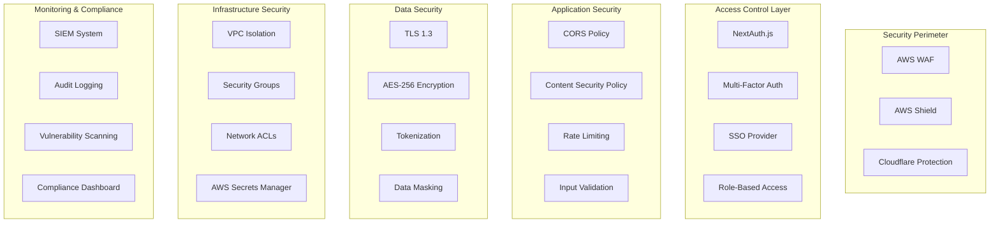

# Security & Compliance Architecture

## Pink Blueberry Salon - Enterprise Security Framework

This document outlines the comprehensive security architecture and compliance framework for the Pink Blueberry Salon platform, ensuring PCI DSS, GDPR, and HIPAA compliance where applicable.

## Security Architecture Overview



## 1. Authentication & Authorization

### 1.1 Multi-Factor Authentication System

```typescript
// src/lib/auth/mfa.service.ts
import speakeasy from 'speakeasy';
import QRCode from 'qrcode';
import { prisma } from '@/lib/db';
import { encrypt, decrypt } from '@/lib/crypto';

export class MFAService {
  // Generate TOTP secret for user
  async setupMFA(userId: string): Promise<{
    secret: string;
    qrCode: string;
    backupCodes: string[];
  }> {
    // Generate secret
    const secret = speakeasy.generateSecret({
      name: `Pink Blueberry (${userId})`,
      issuer: 'Pink Blueberry Salon',
      length: 32
    });

    // Generate backup codes
    const backupCodes = this.generateBackupCodes();

    // Encrypt and store secret
    const encryptedSecret = await encrypt(secret.base32);

    await prisma.userMFA.create({
      data: {
        userId,
        secret: encryptedSecret,
        backupCodes: await encrypt(JSON.stringify(backupCodes)),
        isEnabled: false
      }
    });

    // Generate QR code
    const qrCode = await QRCode.toDataURL(secret.otpauth_url!);

    return {
      secret: secret.base32,
      qrCode,
      backupCodes
    };
  }

  // Verify TOTP token
  async verifyToken(userId: string, token: string): Promise<boolean> {
    const mfa = await prisma.userMFA.findUnique({
      where: { userId }
    });

    if (!mfa || !mfa.isEnabled) {
      return false;
    }

    const secret = await decrypt(mfa.secret);

    const verified = speakeasy.totp.verify({
      secret,
      encoding: 'base32',
      token,
      window: 2 // Allow 2 time steps for clock skew
    });

    if (verified) {
      // Log successful authentication
      await this.logAuthEvent(userId, 'mfa_success');
    } else {
      // Log failed attempt
      await this.logAuthEvent(userId, 'mfa_failure');

      // Check for brute force
      await this.checkBruteForce(userId);
    }

    return verified;
  }

  // Verify backup code
  async verifyBackupCode(userId: string, code: string): Promise<boolean> {
    const mfa = await prisma.userMFA.findUnique({
      where: { userId }
    });

    if (!mfa) return false;

    const backupCodes = JSON.parse(await decrypt(mfa.backupCodes));

    const index = backupCodes.indexOf(code);
    if (index === -1) {
      await this.logAuthEvent(userId, 'backup_code_failure');
      return false;
    }

    // Remove used backup code
    backupCodes.splice(index, 1);

    await prisma.userMFA.update({
      where: { userId },
      data: {
        backupCodes: await encrypt(JSON.stringify(backupCodes))
      }
    });

    await this.logAuthEvent(userId, 'backup_code_success');
    return true;
  }

  private generateBackupCodes(count: number = 10): string[] {
    const codes: string[] = [];
    for (let i = 0; i < count; i++) {
      codes.push(
        Math.random().toString(36).substring(2, 10).toUpperCase()
      );
    }
    return codes;
  }

  private async logAuthEvent(
    userId: string,
    eventType: string,
    metadata?: any
  ) {
    await prisma.auditLog.create({
      data: {
        userId,
        action: eventType,
        resource: 'authentication',
        metadata,
        ipAddress: metadata?.ipAddress,
        userAgent: metadata?.userAgent,
        timestamp: new Date()
      }
    });
  }

  private async checkBruteForce(userId: string) {
    const recentFailures = await prisma.auditLog.count({
      where: {
        userId,
        action: 'mfa_failure',
        timestamp: {
          gte: new Date(Date.now() - 15 * 60 * 1000) // Last 15 minutes
        }
      }
    });

    if (recentFailures >= 5) {
      // Lock account
      await prisma.user.update({
        where: { id: userId },
        data: {
          accountLocked: true,
          lockReason: 'Too many failed MFA attempts'
        }
      });

      // Send security alert
      await this.sendSecurityAlert(userId, 'Account locked due to failed MFA attempts');
    }
  }

  private async sendSecurityAlert(userId: string, message: string) {
    // Implementation for sending security alerts
    console.log(`Security alert for user ${userId}: ${message}`);
  }
}
```

### 1.2 Role-Based Access Control (RBAC)

```typescript
// src/lib/auth/rbac.service.ts
import { Permission, Role, Resource } from '@prisma/client';

export class RBACService {
  // Permission matrix
  private static permissions = {
    // Super Admin - Full system access
    SUPER_ADMIN: {
      '*': ['*']
    },

    // Tenant Admin - Full tenant access
    TENANT_ADMIN: {
      tenant: ['read', 'update'],
      salon: ['*'],
      branch: ['*'],
      staff: ['*'],
      service: ['*'],
      booking: ['*'],
      payment: ['*'],
      customer: ['*'],
      report: ['*'],
      settings: ['*']
    },

    // Branch Manager - Branch level access
    BRANCH_MANAGER: {
      branch: ['read', 'update'],
      staff: ['read', 'create', 'update'],
      service: ['read', 'create', 'update'],
      booking: ['*'],
      payment: ['read', 'create', 'refund'],
      customer: ['*'],
      report: ['read', 'generate'],
      inventory: ['*']
    },

    // Staff Member - Limited operational access
    STAFF: {
      booking: ['read', 'create', 'update:assigned'],
      customer: ['read', 'create', 'update'],
      service: ['read'],
      schedule: ['read:own', 'update:own'],
      commission: ['read:own']
    },

    // Receptionist - Front desk operations
    RECEPTIONIST: {
      booking: ['read', 'create', 'update', 'cancel'],
      customer: ['read', 'create', 'update'],
      payment: ['read', 'create'],
      service: ['read'],
      staff: ['read']
    },

    // Customer - Self-service access
    CUSTOMER: {
      booking: ['read:own', 'create:own', 'update:own', 'cancel:own'],
      payment: ['read:own'],
      profile: ['read:own', 'update:own'],
      loyalty: ['read:own'],
      review: ['create:own', 'read', 'update:own']
    }
  };

  // Check permission
  static hasPermission(
    userRole: string,
    resource: string,
    action: string,
    context?: {
      ownerId?: string;
      tenantId?: string;
      branchId?: string;
    }
  ): boolean {
    const rolePermissions = this.permissions[userRole];

    if (!rolePermissions) return false;

    // Check wildcard permissions
    if (rolePermissions['*']?.includes('*')) return true;

    const resourcePermissions = rolePermissions[resource];
    if (!resourcePermissions) return false;

    // Check for wildcard action
    if (resourcePermissions.includes('*')) return true;

    // Check specific action
    if (resourcePermissions.includes(action)) return true;

    // Check ownership-based permissions
    if (context?.ownerId) {
      const ownAction = `${action}:own`;
      if (resourcePermissions.includes(ownAction)) {
        return context.ownerId === context.userId;
      }

      const assignedAction = `${action}:assigned`;
      if (resourcePermissions.includes(assignedAction)) {
        // Check if resource is assigned to user
        return this.checkAssignment(context);
      }
    }

    return false;
  }

  // Create permission middleware
  static authorize(resource: string, action: string) {
    return async (req: Request, res: Response, next: NextFunction) => {
      const session = await getSession(req);

      if (!session?.user) {
        return res.status(401).json({ error: 'Unauthorized' });
      }

      const hasPermission = this.hasPermission(
        session.user.role,
        resource,
        action,
        {
          userId: session.user.id,
          tenantId: session.user.tenantId,
          branchId: req.params.branchId
        }
      );

      if (!hasPermission) {
        // Log unauthorized access attempt
        await this.logAccessAttempt(
          session.user.id,
          resource,
          action,
          false
        );

        return res.status(403).json({ error: 'Forbidden' });
      }

      // Log successful access
      await this.logAccessAttempt(
        session.user.id,
        resource,
        action,
        true
      );

      next();
    };
  }

  private static async checkAssignment(context: any): Promise<boolean> {
    // Implementation for checking resource assignment
    return false;
  }

  private static async logAccessAttempt(
    userId: string,
    resource: string,
    action: string,
    granted: boolean
  ) {
    await prisma.accessLog.create({
      data: {
        userId,
        resource,
        action,
        granted,
        timestamp: new Date()
      }
    });
  }
}

// Usage in API routes
app.get(
  '/api/salons/:salonId',
  RBACService.authorize('salon', 'read'),
  async (req, res) => {
    // Handler implementation
  }
);
```

## 2. Data Security

### 2.1 Encryption Service

```typescript
// src/lib/security/encryption.service.ts
import crypto from 'crypto';
import { KeyManagementService } from '@aws-sdk/client-kms';

export class EncryptionService {
  private kms: KeyManagementService;
  private algorithm = 'aes-256-gcm';

  constructor() {
    this.kms = new KeyManagementService({
      region: process.env.AWS_REGION
    });
  }

  // Field-level encryption for sensitive data
  async encryptField(plaintext: string, context?: string): Promise<{
    ciphertext: string;
    iv: string;
    authTag: string;
    keyId: string;
  }> {
    // Get data encryption key from KMS
    const { Plaintext: dataKey, CiphertextBlob } = await this.kms.generateDataKey({
      KeyId: process.env.KMS_KEY_ID!,
      KeySpec: 'AES_256',
      EncryptionContext: context ? { context } : undefined
    });

    const key = Buffer.from(dataKey!);
    const iv = crypto.randomBytes(16);
    const cipher = crypto.createCipheriv(this.algorithm, key, iv);

    let encrypted = cipher.update(plaintext, 'utf8', 'hex');
    encrypted += cipher.final('hex');

    const authTag = cipher.getAuthTag();

    // Clear the plaintext key from memory
    key.fill(0);

    return {
      ciphertext: encrypted,
      iv: iv.toString('hex'),
      authTag: authTag.toString('hex'),
      keyId: Buffer.from(CiphertextBlob!).toString('base64')
    };
  }

  // Decrypt field
  async decryptField(encryptedData: {
    ciphertext: string;
    iv: string;
    authTag: string;
    keyId: string;
  }, context?: string): Promise<string> {
    // Decrypt the data key
    const { Plaintext } = await this.kms.decrypt({
      CiphertextBlob: Buffer.from(encryptedData.keyId, 'base64'),
      EncryptionContext: context ? { context } : undefined
    });

    const key = Buffer.from(Plaintext!);
    const iv = Buffer.from(encryptedData.iv, 'hex');
    const authTag = Buffer.from(encryptedData.authTag, 'hex');

    const decipher = crypto.createDecipheriv(this.algorithm, key, iv);
    decipher.setAuthTag(authTag);

    let decrypted = decipher.update(encryptedData.ciphertext, 'hex', 'utf8');
    decrypted += decipher.final('utf8');

    // Clear the key from memory
    key.fill(0);

    return decrypted;
  }

  // Tokenization for payment data
  async tokenizePaymentCard(cardData: {
    number: string;
    expMonth: string;
    expYear: string;
    cvv: string;
  }): Promise<string> {
    // Use payment provider tokenization (Stripe)
    const stripe = new Stripe(process.env.STRIPE_SECRET_KEY!);

    const token = await stripe.tokens.create({
      card: {
        number: cardData.number,
        exp_month: cardData.expMonth,
        exp_year: cardData.expYear,
        cvc: cardData.cvv
      }
    });

    return token.id;
  }

  // Data masking for display
  maskSensitiveData(data: string, type: 'email' | 'phone' | 'ssn' | 'card'): string {
    switch (type) {
      case 'email':
        const [username, domain] = data.split('@');
        if (username.length <= 2) return data;
        return `${username[0]}${'*'.repeat(username.length - 2)}${username.slice(-1)}@${domain}`;

      case 'phone':
        return data.replace(/(\d{3})(\d{3})(\d{4})/, '($1) ***-**$3');

      case 'ssn':
        return `***-**-${data.slice(-4)}`;

      case 'card':
        return `****-****-****-${data.slice(-4)}`;

      default:
        return '***MASKED***';
    }
  }

  // Generate encryption key for tenant data isolation
  async generateTenantKey(tenantId: string): Promise<string> {
    const { CiphertextBlob } = await this.kms.generateDataKeyWithoutPlaintext({
      KeyId: process.env.KMS_KEY_ID!,
      KeySpec: 'AES_256',
      EncryptionContext: {
        tenantId,
        purpose: 'tenant-data-encryption'
      }
    });

    return Buffer.from(CiphertextBlob!).toString('base64');
  }
}
```

### 2.2 Database Security

```typescript
// src/lib/security/database-security.ts
import { PrismaClient } from '@prisma/client';
import { EncryptionService } from './encryption.service';

// Prisma middleware for automatic encryption/decryption
export function setupDatabaseSecurity(prisma: PrismaClient) {
  const encryption = new EncryptionService();

  // Encrypt sensitive fields before write
  prisma.$use(async (params, next) => {
    // List of models and fields to encrypt
    const encryptionConfig = {
      customer: ['email', 'phone', 'address'],
      payment: ['cardLastFour', 'accountNumber'],
      staff: ['email', 'phone', 'ssn']
    };

    if (params.action === 'create' || params.action === 'update') {
      const config = encryptionConfig[params.model?.toLowerCase()];

      if (config && params.args.data) {
        for (const field of config) {
          if (params.args.data[field]) {
            const encrypted = await encryption.encryptField(
              params.args.data[field],
              params.model
            );

            params.args.data[`${field}Encrypted`] = encrypted;
            params.args.data[field] = encryption.maskSensitiveData(
              params.args.data[field],
              field as any
            );
          }
        }
      }
    }

    const result = await next(params);

    // Decrypt sensitive fields after read
    if (params.action === 'findUnique' || params.action === 'findFirst') {
      const config = encryptionConfig[params.model?.toLowerCase()];

      if (config && result) {
        for (const field of config) {
          if (result[`${field}Encrypted`]) {
            try {
              result[field] = await encryption.decryptField(
                result[`${field}Encrypted`],
                params.model
              );
            } catch (error) {
              console.error(`Failed to decrypt ${field}:`, error);
              // Keep masked value if decryption fails
            }
          }
        }
      }
    }

    return result;
  });

  // Row-level security for multi-tenancy
  prisma.$use(async (params, next) => {
    // Get current tenant from context
    const tenantId = getCurrentTenantId();

    if (tenantId && params.model !== 'User') {
      // Add tenant filter to queries
      if (params.action === 'findMany' || params.action === 'findFirst') {
        params.args = params.args || {};
        params.args.where = params.args.where || {};
        params.args.where.tenantId = tenantId;
      }

      // Add tenant ID to creates
      if (params.action === 'create') {
        params.args.data = params.args.data || {};
        params.args.data.tenantId = tenantId;
      }

      // Validate tenant ID on updates/deletes
      if (params.action === 'update' || params.action === 'delete') {
        params.args.where = params.args.where || {};
        params.args.where.tenantId = tenantId;
      }
    }

    return next(params);
  });
}
```

## 3. API Security

### 3.1 Rate Limiting & DDoS Protection

```typescript
// src/lib/security/rate-limiter.ts
import { Ratelimit } from '@upstash/ratelimit';
import { Redis } from '@upstash/redis';
import { NextRequest, NextResponse } from 'next/server';

export class RateLimiter {
  private limiters: Map<string, Ratelimit>;

  constructor() {
    const redis = Redis.fromEnv();

    this.limiters = new Map([
      // Different rate limits for different endpoints
      ['api', new Ratelimit({
        redis,
        limiter: Ratelimit.slidingWindow(100, '1 m'),
        analytics: true
      })],

      ['auth', new Ratelimit({
        redis,
        limiter: Ratelimit.slidingWindow(5, '15 m'),
        analytics: true
      })],

      ['booking', new Ratelimit({
        redis,
        limiter: Ratelimit.slidingWindow(20, '1 h'),
        analytics: true
      })],

      ['payment', new Ratelimit({
        redis,
        limiter: Ratelimit.slidingWindow(10, '1 h'),
        analytics: true
      })]
    ]);
  }

  async limit(
    request: NextRequest,
    type: string = 'api'
  ): Promise<{ success: boolean; limit: number; remaining: number; reset: number }> {
    const limiter = this.limiters.get(type) || this.limiters.get('api')!;

    // Use IP address as identifier
    const identifier = this.getIdentifier(request);

    const result = await limiter.limit(identifier);

    // Add rate limit headers to response
    if (!result.success) {
      await this.logRateLimitExceeded(identifier, type);
    }

    return result;
  }

  private getIdentifier(request: NextRequest): string {
    // Try to get real IP from headers
    const forwarded = request.headers.get('x-forwarded-for');
    const realIp = request.headers.get('x-real-ip');
    const cfConnectingIp = request.headers.get('cf-connecting-ip');

    return cfConnectingIp || realIp || forwarded?.split(',')[0] || 'unknown';
  }

  private async logRateLimitExceeded(identifier: string, type: string) {
    await prisma.securityLog.create({
      data: {
        type: 'rate_limit_exceeded',
        identifier,
        endpoint: type,
        timestamp: new Date()
      }
    });

    // Check for DDoS pattern
    const recentViolations = await prisma.securityLog.count({
      where: {
        type: 'rate_limit_exceeded',
        identifier,
        timestamp: {
          gte: new Date(Date.now() - 60 * 60 * 1000) // Last hour
        }
      }
    });

    if (recentViolations > 10) {
      // Potential DDoS - trigger CloudFlare protection
      await this.enableEnhancedProtection(identifier);
    }
  }

  private async enableEnhancedProtection(identifier: string) {
    // Integrate with CloudFlare API to enable enhanced protection
    console.log(`Enabling enhanced protection for ${identifier}`);
  }
}

// Middleware implementation
export async function rateLimitMiddleware(request: NextRequest) {
  const rateLimiter = new RateLimiter();
  const path = request.nextUrl.pathname;

  // Determine rate limit type based on path
  let type = 'api';
  if (path.includes('/auth')) type = 'auth';
  else if (path.includes('/booking')) type = 'booking';
  else if (path.includes('/payment')) type = 'payment';

  const { success, limit, remaining, reset } = await rateLimiter.limit(request, type);

  if (!success) {
    return new NextResponse('Too Many Requests', {
      status: 429,
      headers: {
        'X-RateLimit-Limit': limit.toString(),
        'X-RateLimit-Remaining': remaining.toString(),
        'X-RateLimit-Reset': new Date(reset).toISOString(),
        'Retry-After': Math.floor((reset - Date.now()) / 1000).toString()
      }
    });
  }

  // Add rate limit headers to successful responses
  const response = NextResponse.next();
  response.headers.set('X-RateLimit-Limit', limit.toString());
  response.headers.set('X-RateLimit-Remaining', remaining.toString());
  response.headers.set('X-RateLimit-Reset', new Date(reset).toISOString());

  return response;
}
```

### 3.2 Input Validation & Sanitization

```typescript
// src/lib/security/validation.service.ts
import { z } from 'zod';
import DOMPurify from 'isomorphic-dompurify';
import validator from 'validator';

export class ValidationService {
  // SQL injection prevention
  static sanitizeSQL(input: string): string {
    // Remove or escape dangerous SQL characters
    return input
      .replace(/['";\\]/g, '')
      .replace(/--/g, '')
      .replace(/\/\*/g, '')
      .replace(/\*\//g, '')
      .replace(/xp_/gi, '')
      .replace(/sp_/gi, '')
      .replace(/exec/gi, '')
      .replace(/execute/gi, '')
      .replace(/select/gi, '')
      .replace(/insert/gi, '')
      .replace(/update/gi, '')
      .replace(/delete/gi, '')
      .replace(/drop/gi, '')
      .replace(/union/gi, '');
  }

  // XSS prevention
  static sanitizeHTML(input: string): string {
    return DOMPurify.sanitize(input, {
      ALLOWED_TAGS: ['b', 'i', 'em', 'strong', 'a', 'p', 'br'],
      ALLOWED_ATTR: ['href', 'target']
    });
  }

  // NoSQL injection prevention
  static sanitizeNoSQL(input: any): any {
    if (typeof input === 'string') {
      // Remove MongoDB operators
      return input.replace(/[$]/g, '');
    }

    if (Array.isArray(input)) {
      return input.map(item => this.sanitizeNoSQL(item));
    }

    if (typeof input === 'object' && input !== null) {
      const sanitized: any = {};
      for (const [key, value] of Object.entries(input)) {
        // Remove keys starting with $
        if (!key.startsWith('$')) {
          sanitized[key] = this.sanitizeNoSQL(value);
        }
      }
      return sanitized;
    }

    return input;
  }

  // Email validation
  static validateEmail(email: string): boolean {
    return validator.isEmail(email, {
      allow_display_name: false,
      require_tld: true,
      allow_ip_domain: false
    });
  }

  // Phone validation
  static validatePhone(phone: string): boolean {
    return validator.isMobilePhone(phone, 'any', {
      strictMode: false
    });
  }

  // Credit card validation (for non-tokenized testing)
  static validateCreditCard(number: string): boolean {
    return validator.isCreditCard(number);
  }

  // File upload validation
  static validateFileUpload(file: File): {
    valid: boolean;
    error?: string;
  } {
    const maxSize = 10 * 1024 * 1024; // 10MB
    const allowedTypes = [
      'image/jpeg',
      'image/png',
      'image/gif',
      'image/webp',
      'application/pdf'
    ];

    if (file.size > maxSize) {
      return { valid: false, error: 'File size exceeds 10MB' };
    }

    if (!allowedTypes.includes(file.type)) {
      return { valid: false, error: 'Invalid file type' };
    }

    // Check file extension matches MIME type
    const extension = file.name.split('.').pop()?.toLowerCase();
    const expectedExtensions = {
      'image/jpeg': ['jpg', 'jpeg'],
      'image/png': ['png'],
      'image/gif': ['gif'],
      'image/webp': ['webp'],
      'application/pdf': ['pdf']
    };

    const validExtensions = expectedExtensions[file.type];
    if (!validExtensions || !validExtensions.includes(extension || '')) {
      return { valid: false, error: 'File extension does not match file type' };
    }

    return { valid: true };
  }

  // URL validation
  static validateURL(url: string): boolean {
    return validator.isURL(url, {
      protocols: ['http', 'https'],
      require_protocol: true,
      require_valid_protocol: true
    });
  }
}

// Zod schemas for API validation
export const bookingSchema = z.object({
  branchId: z.string().uuid(),
  customerId: z.string().uuid(),
  services: z.array(z.object({
    serviceId: z.string().uuid(),
    staffId: z.string().uuid().optional()
  })).min(1),
  scheduledAt: z.string().datetime(),
  notes: z.string().max(500).optional().transform(val =>
    val ? ValidationService.sanitizeHTML(val) : undefined
  )
});

export const customerSchema = z.object({
  name: z.string().min(2).max(100).transform(ValidationService.sanitizeSQL),
  email: z.string().email().refine(ValidationService.validateEmail),
  phone: z.string().refine(ValidationService.validatePhone),
  dateOfBirth: z.string().datetime().optional(),
  address: z.string().max(200).optional().transform(val =>
    val ? ValidationService.sanitizeSQL(val) : undefined
  )
});
```

## 4. Compliance Frameworks

### 4.1 PCI DSS Compliance

```typescript
// src/lib/compliance/pci-dss.service.ts
export class PCIDSSCompliance {
  // PCI DSS Requirements Implementation

  // Requirement 1: Firewall Configuration
  static getFirewallRules(): FirewallRule[] {
    return [
      {
        name: 'Block all inbound traffic except required ports',
        source: '0.0.0.0/0',
        destination: 'vpc',
        ports: [443, 80],
        action: 'allow',
        protocol: 'tcp'
      },
      {
        name: 'Block direct database access',
        source: '0.0.0.0/0',
        destination: 'database',
        ports: [5432],
        action: 'deny',
        protocol: 'tcp'
      }
    ];
  }

  // Requirement 2: Default Security Parameters
  static validateSecurityParameters(): ComplianceCheck {
    const checks = [
      this.checkDefaultPasswords(),
      this.checkUnnecessaryServices(),
      this.checkSecurityHeaders(),
      this.checkEncryptionProtocols()
    ];

    return {
      compliant: checks.every(c => c.passed),
      checks
    };
  }

  // Requirement 3: Protect Stored Card Data
  static async protectCardData(cardNumber: string): Promise<string> {
    // Never store full card number - only tokenize
    const stripe = new Stripe(process.env.STRIPE_SECRET_KEY!);

    const token = await stripe.tokens.create({
      card: {
        number: cardNumber
      }
    });

    return token.id;
  }

  // Requirement 4: Encrypt Transmission
  static enforceEncryption(): TLSConfig {
    return {
      minVersion: 'TLSv1.3',
      ciphers: [
        'TLS_AES_128_GCM_SHA256',
        'TLS_AES_256_GCM_SHA384',
        'TLS_CHACHA20_POLY1305_SHA256'
      ],
      preferServerCiphers: true,
      sessionTimeout: 300
    };
  }

  // Requirement 8: Identify and Authenticate Access
  static enforceAccessControl(): AccessPolicy {
    return {
      passwordPolicy: {
        minLength: 12,
        requireUppercase: true,
        requireLowercase: true,
        requireNumbers: true,
        requireSpecialChars: true,
        expirationDays: 90,
        historyCount: 4
      },
      mfaRequired: true,
      sessionTimeout: 900, // 15 minutes
      lockoutPolicy: {
        attempts: 5,
        duration: 1800 // 30 minutes
      }
    };
  }

  // Requirement 10: Track and Monitor Access
  static async logCardDataAccess(
    userId: string,
    action: string,
    resource: string,
    success: boolean
  ) {
    await prisma.pciAuditLog.create({
      data: {
        userId,
        action,
        resource,
        success,
        timestamp: new Date(),
        ipAddress: getCurrentIP(),
        userAgent: getCurrentUserAgent()
      }
    });
  }

  // Requirement 12: Security Policy
  static generateSecurityPolicy(): SecurityPolicy {
    return {
      dataRetention: {
        cardData: 'never_store',
        transactionData: '7_years',
        auditLogs: '3_years'
      },
      incidentResponse: {
        contactEmail: 'security@pinkblueberry.com',
        responseTime: '1_hour',
        escalationPath: ['security_team', 'cto', 'ceo']
      },
      training: {
        frequency: 'annual',
        topics: ['pci_dss', 'data_security', 'phishing']
      }
    };
  }
}
```

### 4.2 GDPR Compliance

```typescript
// src/lib/compliance/gdpr.service.ts
export class GDPRCompliance {
  // Right to Access (Article 15)
  static async exportUserData(userId: string): Promise<UserDataExport> {
    const [
      user,
      customer,
      bookings,
      payments,
      reviews,
      auditLogs
    ] = await Promise.all([
      prisma.user.findUnique({ where: { id: userId } }),
      prisma.customer.findFirst({ where: { userId } }),
      prisma.booking.findMany({ where: { customer: { userId } } }),
      prisma.payment.findMany({
        where: { booking: { customer: { userId } } }
      }),
      prisma.review.findMany({ where: { customer: { userId } } }),
      prisma.auditLog.findMany({ where: { userId } })
    ]);

    return {
      personalData: {
        user: this.sanitizeUserData(user),
        customer: this.sanitizeCustomerData(customer)
      },
      transactionalData: {
        bookings: bookings.map(this.sanitizeBookingData),
        payments: payments.map(this.sanitizePaymentData),
        reviews
      },
      activityData: {
        auditLogs: auditLogs.map(this.sanitizeAuditLog)
      },
      exportedAt: new Date(),
      format: 'json'
    };
  }

  // Right to Erasure (Article 17)
  static async deleteUserData(
    userId: string,
    reason: string
  ): Promise<DeletionResult> {
    // Check for legal obligations to retain data
    const retentionRequired = await this.checkRetentionRequirements(userId);

    if (retentionRequired.required) {
      return {
        success: false,
        reason: retentionRequired.reason,
        retentionUntil: retentionRequired.until
      };
    }

    // Perform deletion/anonymization
    await prisma.$transaction([
      // Anonymize user data
      prisma.user.update({
        where: { id: userId },
        data: {
          email: `deleted-${userId}@example.com`,
          name: 'Deleted User',
          hashedPassword: null,
          phone: null,
          image: null,
          deletedAt: new Date(),
          deletionReason: reason
        }
      }),

      // Anonymize customer data
      prisma.customer.updateMany({
        where: { userId },
        data: {
          email: `deleted-${userId}@example.com`,
          name: 'Deleted Customer',
          phone: '0000000000',
          dateOfBirth: null,
          address: null,
          notes: null
        }
      }),

      // Remove from marketing lists
      prisma.marketingConsent.deleteMany({
        where: { userId }
      })
    ]);

    // Log deletion
    await this.logDeletion(userId, reason);

    return {
      success: true,
      deletedAt: new Date()
    };
  }

  // Right to Portability (Article 20)
  static async exportPortableData(userId: string): Promise<Buffer> {
    const data = await this.exportUserData(userId);

    // Convert to machine-readable format (JSON or CSV)
    const jsonData = JSON.stringify(data, null, 2);

    // Create a signed URL for download
    const filename = `user-data-${userId}-${Date.now()}.json`;
    const buffer = Buffer.from(jsonData);

    // Store temporarily in S3 with expiration
    await s3.putObject({
      Bucket: 'gdpr-exports',
      Key: filename,
      Body: buffer,
      Expires: new Date(Date.now() + 24 * 60 * 60 * 1000) // 24 hours
    }).promise();

    return buffer;
  }

  // Consent Management
  static async updateConsent(
    userId: string,
    consents: ConsentUpdate[]
  ): Promise<void> {
    for (const consent of consents) {
      await prisma.consent.upsert({
        where: {
          userId_purpose: {
            userId,
            purpose: consent.purpose
          }
        },
        create: {
          userId,
          purpose: consent.purpose,
          granted: consent.granted,
          grantedAt: consent.granted ? new Date() : null,
          revokedAt: !consent.granted ? new Date() : null,
          ipAddress: consent.ipAddress,
          userAgent: consent.userAgent
        },
        update: {
          granted: consent.granted,
          grantedAt: consent.granted ? new Date() : undefined,
          revokedAt: !consent.granted ? new Date() : undefined,
          ipAddress: consent.ipAddress,
          userAgent: consent.userAgent
        }
      });
    }
  }

  // Data Breach Notification
  static async reportDataBreach(breach: DataBreach): Promise<void> {
    // Log the breach
    const breachRecord = await prisma.dataBreach.create({
      data: {
        description: breach.description,
        affectedUsers: breach.affectedUserIds.length,
        dataTypes: breach.dataTypes,
        discoveredAt: breach.discoveredAt,
        severity: breach.severity
      }
    });

    // Notify affected users within 72 hours
    if (breach.severity === 'HIGH') {
      await this.notifyAffectedUsers(breach.affectedUserIds, breachRecord.id);

      // Notify supervisory authority
      await this.notifyDataProtectionAuthority(breachRecord);
    }
  }

  private static async checkRetentionRequirements(userId: string) {
    // Check for financial records (7 years retention)
    const hasFinancialRecords = await prisma.payment.count({
      where: {
        booking: { customer: { userId } },
        createdAt: {
          gte: new Date(Date.now() - 7 * 365 * 24 * 60 * 60 * 1000)
        }
      }
    });

    if (hasFinancialRecords > 0) {
      return {
        required: true,
        reason: 'Financial records must be retained for 7 years',
        until: new Date(Date.now() + 7 * 365 * 24 * 60 * 60 * 1000)
      };
    }

    return { required: false };
  }
}
```

## 5. Security Monitoring

### 5.1 SIEM Integration

```typescript
// src/lib/security/siem.service.ts
import { EventBridge } from '@aws-sdk/client-eventbridge';

export class SIEMService {
  private eventBridge: EventBridge;

  constructor() {
    this.eventBridge = new EventBridge({
      region: process.env.AWS_REGION
    });
  }

  // Send security events to SIEM
  async logSecurityEvent(event: SecurityEvent) {
    await this.eventBridge.putEvents({
      Entries: [
        {
          Source: 'pinkblueberry.security',
          DetailType: event.type,
          Detail: JSON.stringify({
            ...event,
            timestamp: new Date().toISOString(),
            environment: process.env.NODE_ENV,
            service: 'web-app'
          })
        }
      ]
    });

    // Also log to CloudWatch
    await cloudWatch.putMetricData({
      Namespace: 'Security',
      MetricData: [
        {
          MetricName: event.type,
          Value: 1,
          Unit: 'Count',
          Timestamp: new Date()
        }
      ]
    });
  }

  // Detect anomalies
  async detectAnomalies(userId: string): Promise<AnomalyResult[]> {
    const anomalies: AnomalyResult[] = [];

    // Check for unusual login patterns
    const loginPattern = await this.analyzeLoginPattern(userId);
    if (loginPattern.anomaly) {
      anomalies.push(loginPattern);
    }

    // Check for unusual transaction patterns
    const transactionPattern = await this.analyzeTransactionPattern(userId);
    if (transactionPattern.anomaly) {
      anomalies.push(transactionPattern);
    }

    // Check for privilege escalation attempts
    const privilegeCheck = await this.checkPrivilegeEscalation(userId);
    if (privilegeCheck.anomaly) {
      anomalies.push(privilegeCheck);
    }

    if (anomalies.length > 0) {
      await this.triggerSecurityAlert(userId, anomalies);
    }

    return anomalies;
  }

  private async analyzeLoginPattern(userId: string): Promise<AnomalyResult> {
    const recentLogins = await prisma.auditLog.findMany({
      where: {
        userId,
        action: 'login',
        timestamp: {
          gte: new Date(Date.now() - 24 * 60 * 60 * 1000)
        }
      }
    });

    // Check for multiple login locations
    const locations = new Set(recentLogins.map(l => l.ipAddress));

    if (locations.size > 3) {
      return {
        anomaly: true,
        type: 'multiple_login_locations',
        severity: 'medium',
        details: `User logged in from ${locations.size} different locations`
      };
    }

    // Check for unusual login times
    const unusualTimes = recentLogins.filter(l => {
      const hour = new Date(l.timestamp).getHours();
      return hour >= 2 && hour <= 5; // 2 AM - 5 AM
    });

    if (unusualTimes.length > 0) {
      return {
        anomaly: true,
        type: 'unusual_login_time',
        severity: 'low',
        details: `User logged in at unusual times`
      };
    }

    return { anomaly: false };
  }

  private async triggerSecurityAlert(
    userId: string,
    anomalies: AnomalyResult[]
  ) {
    // Send to security team
    await sns.publish({
      TopicArn: process.env.SECURITY_ALERT_TOPIC,
      Subject: 'Security Anomaly Detected',
      Message: JSON.stringify({
        userId,
        anomalies,
        timestamp: new Date()
      })
    }).promise();

    // Log to security audit
    await prisma.securityAlert.create({
      data: {
        userId,
        anomalies: JSON.stringify(anomalies),
        status: 'pending_review',
        createdAt: new Date()
      }
    });
  }
}
```

## 6. Incident Response

### 6.1 Incident Response Plan

```typescript
// src/lib/security/incident-response.ts
export class IncidentResponse {
  // Incident detection and classification
  static async detectIncident(event: SecurityEvent): Promise<Incident | null> {
    const classification = this.classifyEvent(event);

    if (classification.isIncident) {
      const incident = await this.createIncident(event, classification);
      await this.initiateResponse(incident);
      return incident;
    }

    return null;
  }

  private static classifyEvent(event: SecurityEvent): Classification {
    const rules = [
      {
        condition: event.type === 'data_breach',
        severity: 'critical',
        isIncident: true
      },
      {
        condition: event.type === 'unauthorized_access' &&
                   event.details.privileged === true,
        severity: 'high',
        isIncident: true
      },
      {
        condition: event.type === 'ddos_attack',
        severity: 'high',
        isIncident: true
      },
      {
        condition: event.type === 'malware_detected',
        severity: 'critical',
        isIncident: true
      }
    ];

    for (const rule of rules) {
      if (rule.condition) {
        return rule;
      }
    }

    return { isIncident: false };
  }

  private static async initiateResponse(incident: Incident) {
    const responseSteps = [
      this.containIncident(incident),
      this.notifyStakeholders(incident),
      this.preserveEvidence(incident),
      this.assessImpact(incident)
    ];

    await Promise.all(responseSteps);

    // Create runbook execution
    await this.executeRunbook(incident);
  }

  private static async executeRunbook(incident: Incident) {
    const runbook = this.getRunbook(incident.type);

    for (const step of runbook.steps) {
      try {
        await this.executeStep(step, incident);

        await prisma.incidentLog.create({
          data: {
            incidentId: incident.id,
            step: step.name,
            status: 'completed',
            timestamp: new Date()
          }
        });
      } catch (error) {
        await prisma.incidentLog.create({
          data: {
            incidentId: incident.id,
            step: step.name,
            status: 'failed',
            error: error.message,
            timestamp: new Date()
          }
        });

        // Escalate if critical step fails
        if (step.critical) {
          await this.escalateIncident(incident);
        }
      }
    }
  }

  private static getRunbook(incidentType: string): Runbook {
    const runbooks = {
      data_breach: {
        steps: [
          { name: 'Isolate affected systems', critical: true },
          { name: 'Identify scope of breach', critical: true },
          { name: 'Reset affected credentials', critical: true },
          { name: 'Notify legal team', critical: true },
          { name: 'Prepare user notifications', critical: false },
          { name: 'Implement additional monitoring', critical: false }
        ]
      },
      ddos_attack: {
        steps: [
          { name: 'Enable DDoS protection', critical: true },
          { name: 'Increase rate limits', critical: true },
          { name: 'Block malicious IPs', critical: true },
          { name: 'Scale infrastructure', critical: false },
          { name: 'Monitor traffic patterns', critical: false }
        ]
      }
    };

    return runbooks[incidentType] || { steps: [] };
  }
}
```

## Security Dashboard

```typescript
// src/app/admin/security/page.tsx
import { Card, CardContent, CardHeader, CardTitle } from '@/components/ui/card';
import { SecurityMetrics } from '@/components/security/metrics';
import { ThreatMap } from '@/components/security/threat-map';
import { ComplianceStatus } from '@/components/security/compliance';

export default async function SecurityDashboard() {
  const [metrics, threats, compliance] = await Promise.all([
    getSecurityMetrics(),
    getThreatIntelligence(),
    getComplianceStatus()
  ]);

  return (
    <div className="container mx-auto p-6">
      <h1 className="text-3xl font-bold mb-8">Security Dashboard</h1>

      <div className="grid grid-cols-1 md:grid-cols-3 gap-6 mb-8">
        <Card>
          <CardHeader>
            <CardTitle>Security Score</CardTitle>
          </CardHeader>
          <CardContent>
            <div className="text-4xl font-bold text-green-600">
              {metrics.securityScore}/100
            </div>
          </CardContent>
        </Card>

        <Card>
          <CardHeader>
            <CardTitle>Active Threats</CardTitle>
          </CardHeader>
          <CardContent>
            <div className="text-4xl font-bold text-red-600">
              {threats.activeCount}
            </div>
          </CardContent>
        </Card>

        <Card>
          <CardHeader>
            <CardTitle>Compliance Status</CardTitle>
          </CardHeader>
          <CardContent>
            <div className="space-y-2">
              <div>PCI DSS: {compliance.pciDss ? '✅' : '❌'}</div>
              <div>GDPR: {compliance.gdpr ? '✅' : '❌'}</div>
              <div>HIPAA: {compliance.hipaa ? '✅' : '❌'}</div>
            </div>
          </CardContent>
        </Card>
      </div>

      <div className="grid grid-cols-1 md:grid-cols-2 gap-6">
        <SecurityMetrics data={metrics} />
        <ThreatMap threats={threats.locations} />
        <ComplianceStatus compliance={compliance} />
      </div>
    </div>
  );
}
```

This comprehensive security and compliance architecture provides:

1. **Authentication**: Multi-factor authentication with TOTP
2. **Authorization**: Fine-grained RBAC system
3. **Data Security**: Field-level encryption and tokenization
4. **API Security**: Rate limiting and input validation
5. **Compliance**: PCI DSS, GDPR, and HIPAA frameworks
6. **Monitoring**: SIEM integration and anomaly detection
7. **Incident Response**: Automated response procedures