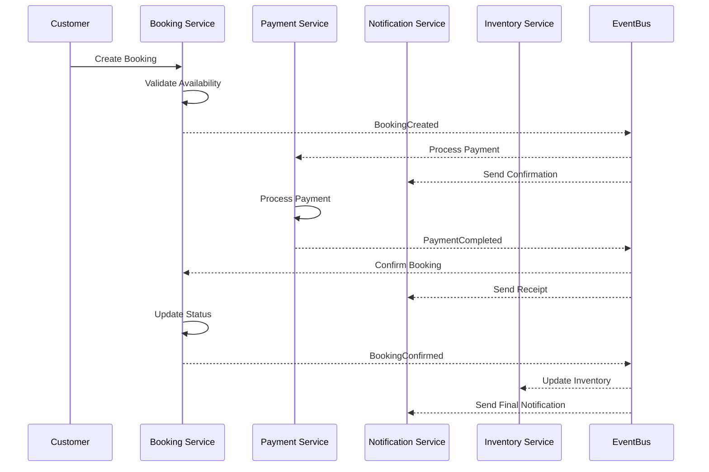

# ADR-003: Event-Driven Architecture and Communication Patterns

## Status
Accepted

## Context
The system requires loose coupling between services while maintaining data consistency and enabling real-time features. We need to handle complex business workflows that span multiple bounded contexts, such as booking confirmation, payment processing, and inventory updates.

## Decision
We will implement a comprehensive event-driven architecture with the following components:

### Event Architecture
- **Event Sourcing**: Store all business events as immutable facts
- **Event Bus**: Central event distribution mechanism
- **Event Handlers**: Asynchronous event processing
- **Saga Pattern**: Orchestrate complex multi-service workflows
- **CQRS**: Separate command and query responsibilities

### Event Types and Patterns
```typescript
// Domain Events
interface DomainEvent {
  id: string;
  type: string;
  aggregateId: string;
  timestamp: Date;
  payload: Record<string, any>;
  metadata: {
    userId?: string;
    tenantId: string;
    correlationId: string;
    version?: number;
  };
}

// Event Categories
enum EventCategories {
  BOOKING = 'booking',
  PAYMENT = 'payment',
  INVENTORY = 'inventory',
  CUSTOMER = 'customer',
  SALON = 'salon',
  NOTIFICATION = 'notification'
}
```

### Event Store Implementation
- **PostgreSQL-based**: Events stored in relational tables
- **Append-Only**: Immutable event log
- **Snapshotting**: Periodic snapshots for performance
- **Partitioning**: Time-based partitioning for scalability

### Event Processing Patterns
1. **Event Handler Registration**: Type-safe event subscription
2. **Parallel Processing**: Independent handlers run concurrently
3. **Retry Mechanisms**: Exponential backoff for failed events
4. **Dead Letter Queue**: Failed events for manual processing
5. **Idempotency**: Handler idempotency for reliability

## Event Workflows

### Booking Workflow


### Event Handler Examples
```typescript
// Booking notification handler
class BookingNotificationHandler extends BaseEventHandler {
  protected eventTypes = [
    'booking.created',
    'booking.confirmed',
    'booking.cancelled'
  ];

  async handle(event: DomainEvent): Promise<void> {
    switch (event.type) {
      case 'booking.created':
        await this.sendBookingCreatedNotification(event);
        break;
      case 'booking.confirmed':
        await this.sendBookingConfirmedNotification(event);
        break;
      case 'booking.cancelled':
        await this.sendBookingCancelledNotification(event);
        break;
    }
  }
}

// Inventory update handler
class InventoryUpdateHandler extends BaseEventHandler {
  protected eventTypes = ['booking.service.completed'];

  async handle(event: DomainEvent): Promise<void> {
    const { serviceId, productUsage } = event.payload;
    await this.updateProductInventory(serviceId, productUsage);
  }
}
```

## Event Store Schema
```sql
-- Events table
CREATE TABLE events (
  id UUID PRIMARY KEY DEFAULT gen_random_uuid(),
  stream_id VARCHAR(255) NOT NULL,
  version INTEGER NOT NULL,
  event_type VARCHAR(255) NOT NULL,
  event_data JSONB NOT NULL,
  metadata JSONB NOT NULL,
  timestamp TIMESTAMP WITH TIME ZONE DEFAULT NOW(),
  tenant_id VARCHAR(255) NOT NULL
);

-- Snapshots table for performance
CREATE TABLE snapshots (
  aggregate_id VARCHAR(255) PRIMARY KEY,
  aggregate_type VARCHAR(255) NOT NULL,
  version INTEGER NOT NULL,
  data JSONB NOT NULL,
  timestamp TIMESTAMP WITH TIME ZONE DEFAULT NOW(),
  tenant_id VARCHAR(255) NOT NULL
);

-- Event projections for read models
CREATE TABLE booking_projections (
  id VARCHAR(255) PRIMARY KEY,
  customer_id VARCHAR(255) NOT NULL,
  branch_id VARCHAR(255) NOT NULL,
  status VARCHAR(50) NOT NULL,
  scheduled_at TIMESTAMP WITH TIME ZONE NOT NULL,
  total_amount DECIMAL(10,2) NOT NULL,
  created_at TIMESTAMP WITH TIME ZONE NOT NULL,
  updated_at TIMESTAMP WITH TIME ZONE NOT NULL,
  tenant_id VARCHAR(255) NOT NULL
);
```

## Consistency and Reliability

### Eventual Consistency Strategy
- **Accept Temporary Inconsistency**: Between bounded contexts
- **Strong Consistency**: Within aggregate boundaries
- **Compensation**: Rollback through compensating events
- **Monitoring**: Track consistency lag and failures

### Error Handling Patterns
```typescript
class EventBus {
  private async processEvent(event: DomainEvent): Promise<void> {
    const handlers = this.getHandlers(event.type);

    // Process handlers in parallel with error isolation
    const results = await Promise.allSettled(
      handlers.map(handler => this.executeHandler(handler, event))
    );

    // Handle failures
    results.forEach((result, index) => {
      if (result.status === 'rejected') {
        this.handleEventFailure(event, handlers[index], result.reason);
      }
    });
  }

  private async handleEventFailure(
    event: DomainEvent,
    handler: EventHandler,
    error: any
  ): Promise<void> {
    // Add to dead letter queue
    this.deadLetterQueue.push({
      event,
      handler: handler.constructor.name,
      error: error.message,
      timestamp: new Date(),
      retryCount: 0
    });

    // Schedule retry with exponential backoff
    await this.scheduleRetry(event, handler, error);
  }
}
```

### Saga Pattern Implementation
```typescript
class BookingConfirmationSaga {
  async handle(event: BookingCreatedEvent): Promise<void> {
    const saga = new SagaTransaction(event.aggregateId);

    try {
      // Step 1: Reserve inventory
      await saga.execute(
        () => this.inventoryService.reserve(event.payload.items),
        () => this.inventoryService.unreserve(event.payload.items)
      );

      // Step 2: Process payment
      await saga.execute(
        () => this.paymentService.charge(event.payload.payment),
        () => this.paymentService.refund(event.payload.payment)
      );

      // Step 3: Confirm booking
      await saga.execute(
        () => this.bookingService.confirm(event.aggregateId),
        () => this.bookingService.cancel(event.aggregateId)
      );

      await saga.commit();
    } catch (error) {
      await saga.rollback();
      throw error;
    }
  }
}
```

## Real-time Features

### WebSocket Integration
```typescript
class RealtimeEventHandler extends BaseEventHandler {
  protected eventTypes = [
    'booking.created',
    'booking.confirmed',
    'availability.updated'
  ];

  async handle(event: DomainEvent): Promise<void> {
    // Broadcast to connected clients
    const room = `tenant:${event.metadata.tenantId}`;
    this.socketService.broadcast(room, {
      type: event.type,
      data: event.payload,
      timestamp: event.timestamp
    });
  }
}
```

### Event Streaming
- **Real-time Availability**: Broadcast slot changes immediately
- **Live Updates**: Push booking status changes to clients
- **Dashboard Metrics**: Stream business metrics for dashboards
- **Notification Delivery**: Real-time notification push

## Consequences

### Positive
- **Loose Coupling**: Services communicate through events
- **Scalability**: Asynchronous processing handles high loads
- **Auditability**: Complete event history for compliance
- **Flexibility**: Easy to add new event handlers
- **Real-time Capabilities**: Immediate updates across system
- **Fault Tolerance**: System continues operating with service failures

### Negative
- **Complexity**: Distributed system debugging challenges
- **Eventual Consistency**: Temporary data inconsistencies
- **Event Ordering**: Challenges with event sequence guarantees
- **Storage Overhead**: Event store grows continuously
- **Operational Overhead**: Monitoring event processing health

## Testing Strategy
- **Event Replay**: Test scenarios by replaying events
- **Handler Testing**: Unit test event handlers in isolation
- **Integration Testing**: End-to-end event flow validation
- **Chaos Testing**: Test system resilience with failures
- **Load Testing**: Validate event processing under load

## Migration and Evolution
- **Event Versioning**: Support multiple event schema versions
- **Handler Deployment**: Blue-green deployment for handlers
- **Schema Evolution**: Backward-compatible event schema changes
- **Event Upcasting**: Transform old events to new formats
- **Replay Capability**: Rebuild projections from events

## Performance Considerations
- **Batch Processing**: Group events for efficient processing
- **Parallel Handlers**: Execute independent handlers concurrently
- **Caching**: Cache frequently accessed projections
- **Partitioning**: Partition events by tenant or time
- **Compression**: Compress old events for storage efficiency