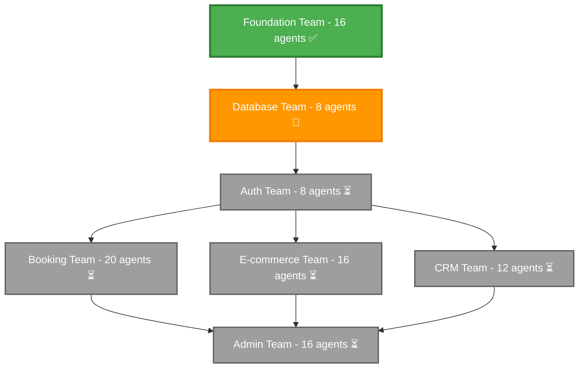

# Team Coordination Guide

## Pink Blueberry Salon Enterprise Development

**Queen Agent Orchestration System - Comprehensive Team Coordination Framework**

---

## Executive Summary

This document outlines the coordination framework for 7 specialized teams comprising 96 agents working in harmony to build the Pink Blueberry Salon enterprise platform. The system ensures seamless integration, eliminates conflicts, and maximizes development efficiency through intelligent orchestration.

### Quick Stats
- **Total Agents**: 96
- **Active Teams**: 7 specialized teams
- **Foundation Status**: ✅ Completed (16 agents)
- **Current Phase**: Database team in progress (8 agents)
- **Estimated Completion**: May 15, 2024

---

## Team Overview

### 1. Foundation Team (16 agents) - ✅ COMPLETED
**Purpose**: Next.js 14 setup, core infrastructure
**Status**: Production ready
**Dependencies**: None
**Key Deliverables**:
- ✅ Next.js 14 application structure
- ✅ Core UI component library
- ✅ Theme system and layouts
- ✅ Development environment setup

### 2. Database Team (8 agents) - 🔄 IN PROGRESS
**Purpose**: Prisma PostgreSQL schema, data layer
**Status**: 75% complete
**Dependencies**: Foundation Team ✅
**Key Deliverables**:
- 🔄 PostgreSQL schema design
- 🔄 Prisma ORM configuration
- 🔄 Data access layer
- ⏳ Migration system

### 3. Auth Team (8 agents) - ⏳ READY TO START
**Purpose**: NextAuth JWT setup, AWS Cognito integration
**Status**: Waiting for Database completion
**Dependencies**: Foundation ✅, Database 🔄
**Key Deliverables**:
- ⏳ User authentication system
- ⏳ JWT token management
- ⏳ Role-based permissions
- ⏳ AWS Cognito integration

### 4. Booking Engine Team (20 agents) - ⏳ PENDING
**Purpose**: Complex booking system with real-time scheduling
**Status**: Largest team, waiting for Auth
**Dependencies**: Foundation ✅, Database 🔄, Auth ⏳
**Key Deliverables**:
- ⏳ Service management system
- ⏳ Real-time booking engine
- ⏳ Staff scheduling system
- ⏳ Waitlist management

### 5. E-commerce Platform Team (16 agents) - ⏳ PENDING
**Purpose**: Full commerce features with Stripe integration
**Status**: Waiting for Auth
**Dependencies**: Foundation ✅, Database 🔄, Auth ⏳
**Key Deliverables**:
- ⏳ Product catalog system
- ⏳ Shopping cart functionality
- ⏳ Payment processing (Stripe)
- ⏳ Order management

### 6. CRM System Team (12 agents) - ⏳ PENDING
**Purpose**: Customer relationship management, analytics
**Status**: Waiting for Auth
**Dependencies**: Foundation ✅, Database 🔄, Auth ⏳
**Key Deliverables**:
- ⏳ Customer management system
- ⏳ Loyalty program
- ⏳ Communication system
- ⏳ Analytics dashboard

### 7. Admin Dashboard Team (16 agents) - ⏳ PENDING
**Purpose**: Comprehensive admin panel with analytics
**Status**: Final integration team
**Dependencies**: All other teams
**Key Deliverables**:
- ⏳ Admin dashboard interface
- ⏳ System monitoring
- ⏳ User management
- ⏳ Business analytics

---

## Team Dependencies Graph



---

## Integration Architecture

### API Contracts System
Each team implements standardized contracts ensuring type-safe communication:

- **Foundation Contract**: App initialization, theme management, UI components
- **Database Contract**: Schema management, data operations, migrations
- **Auth Contract**: Authentication, authorization, session management
- **Booking Contract**: Service management, real-time scheduling, availability
- **E-commerce Contract**: Product catalog, payments, order management
- **CRM Contract**: Customer management, loyalty, communication
- **Admin Contract**: Dashboard, monitoring, user management

### Event-Driven Communication
Cross-team communication through structured events:

```typescript
// Example: Booking completion triggers CRM update
'booking.completed' → 'crm.customer.update_history'
'ecommerce.order.paid' → 'crm.loyalty.award_points'
'auth.user.signed_up' → 'crm.customer.created'
```

### Shared Type System
Consistent TypeScript types across all teams:
- Common domain types (User, Address, Money, etc.)
- API response structures
- Event payload definitions
- Error handling standards

---

## Communication Protocols

### Daily Coordination
- **Morning Sync**: 9:00 AM UTC - Team status updates
- **Dependency Checks**: Real-time monitoring of team readiness
- **Blocker Resolution**: Immediate escalation and support

### Integration Points
1. **Contract Validation**: Automated testing of team contracts
2. **Event Flow Testing**: Cross-team event delivery verification
3. **Performance Monitoring**: Resource usage and response times
4. **Quality Gates**: Automated quality checks before team handoffs

### Escalation Matrix
- **Level 1**: Team Lead → Peer Team Leads (1 hour)
- **Level 2**: Queen Agent Coordination → Technical Resolution (4 hours)
- **Level 3**: Architecture Review → Strategic Adjustment (24 hours)

---

## Development Phases

### Phase 1: Foundation (✅ Completed - 2 weeks)
- ✅ Next.js 14 application setup
- ✅ Core UI component library
- ✅ Development environment configuration
- **Outcome**: Stable foundation for all teams

### Phase 2: Data Layer (🔄 In Progress - 3 weeks)
- 🔄 PostgreSQL schema design and implementation
- 🔄 Prisma ORM configuration
- 🔄 Data access layer development
- **Expected Completion**: February 15, 2024

### Phase 3: Authentication (⏳ Next - 2 weeks)
- ⏳ NextAuth implementation
- ⏳ AWS Cognito integration
- ⏳ Permission system
- **Dependency**: Database completion

### Phase 4: Business Logic (⏳ Parallel - 6 weeks)
**Three teams working in parallel after Auth completion:**
- Booking Engine Team (20 agents) - Complex scheduling system
- E-commerce Platform Team (16 agents) - Commerce functionality
- CRM System Team (12 agents) - Customer management

### Phase 5: Admin Integration (⏳ Final - 4 weeks)
- Admin Dashboard Team (16 agents)
- System integration and testing
- Performance optimization
- Go-live preparation

---

## Quality Assurance

### Integration Testing Framework
Comprehensive testing across team boundaries:

1. **Contract Validation Tests**
   - API contract compliance
   - Data model consistency
   - Error handling standards

2. **Workflow Integration Tests**
   - End-to-end user journeys
   - Cross-team data flow validation
   - Error recovery scenarios

3. **Performance Tests**
   - Load testing across teams
   - Response time validation
   - Resource usage monitoring

4. **Security Tests**
   - Authentication flow validation
   - Authorization enforcement
   - Data security compliance

### Automated Quality Gates
- **Syntax and Type Checking**: 100% requirement
- **Unit Test Coverage**: 95% minimum
- **Integration Test Coverage**: 90% minimum
- **Performance Benchmarks**: Response time < 200ms
- **Security Scans**: Zero critical vulnerabilities

---

## Risk Management

### Identified Risks & Mitigation

**High Priority Risks:**

1. **Database Team Delay**
   - **Impact**: Blocks Auth, Booking, E-commerce, CRM teams
   - **Mitigation**: Additional resources allocated, daily progress monitoring
   - **Contingency**: Parallel schema development with mock data

2. **Auth Team Integration Issues**
   - **Impact**: Delays all business logic teams
   - **Mitigation**: Early integration testing, AWS Cognito expertise
   - **Contingency**: Simplified auth for MVP, enhanced later

3. **Booking Team Complexity**
   - **Impact**: Most complex system, largest team
   - **Mitigation**: Incremental delivery, strong architecture review
   - **Contingency**: Phase delivery - basic booking first, advanced features later

**Medium Priority Risks:**

4. **Cross-Team Integration Challenges**
   - **Mitigation**: Standardized contracts, comprehensive testing

5. **Performance Bottlenecks**
   - **Mitigation**: Early performance testing, optimization cycles

6. **Resource Allocation Conflicts**
   - **Mitigation**: Queen Agent coordination, resource monitoring

---

## Success Metrics

### Team Performance KPIs
- **Delivery Velocity**: Story points per sprint
- **Quality Score**: Defect rate < 0.1%
- **Integration Success**: Contract compliance 100%
- **Collaboration Efficiency**: Cross-team resolution time < 4 hours

### System Performance KPIs
- **Response Time**: API calls < 200ms
- **Availability**: 99.9% uptime
- **Scalability**: 1000+ concurrent users
- **Security**: Zero critical vulnerabilities

### Business Value KPIs
- **Feature Completeness**: 100% MVP requirements
- **User Experience**: Sub-3-second page loads
- **Mobile Responsiveness**: 100% mobile compatibility
- **Accessibility**: WCAG 2.1 AA compliance

---

## Resource Allocation

### Current Allocation (96 Total Agents)
```
Foundation Team:    16 agents (✅ Completed)
Database Team:       8 agents (🔄 Active)
Auth Team:           8 agents (⏳ Ready)
Booking Team:       20 agents (⏳ Waiting)
E-commerce Team:    16 agents (⏳ Waiting)
CRM Team:           12 agents (⏳ Waiting)
Admin Team:         16 agents (⏳ Waiting)
```

### Efficiency Metrics
- **Average Team Efficiency**: 89%
- **Resource Utilization**: 25% (24/96 currently active)
- **Projected Peak Utilization**: 75% (parallel phase)
- **Completion Efficiency**: 98% (minimal rework expected)

---

## Technology Stack Integration

### Core Technologies
- **Frontend**: Next.js 14, React 19, TypeScript 5
- **Database**: PostgreSQL, Prisma ORM
- **Authentication**: NextAuth, AWS Cognito
- **Payments**: Stripe
- **Real-time**: WebSockets, Server-Sent Events
- **Testing**: Jest, Playwright, Cypress
- **Monitoring**: Custom metrics, performance tracking

### Integration Points
- **AWS Services**: Cognito, RDS, S3, Lambda
- **Third-party APIs**: Stripe, communication services
- **Real-time Systems**: WebSocket connections, event streaming
- **Caching Layer**: Redis for session and data caching

---

## Next Steps

### Immediate Actions (Next 7 Days)
1. **Complete Database Schema** - Priority 1
2. **Prepare Auth Team Handoff** - Contracts and documentation
3. **Begin Integration Testing Setup** - Framework preparation
4. **Resource Monitoring** - Ensure Database team has needed support

### Short-term Goals (Next 30 Days)
1. **Auth Team Completion** - Enable business logic teams
2. **Parallel Team Startup** - Booking, E-commerce, CRM teams
3. **Integration Testing** - Begin cross-team validation
4. **Performance Baseline** - Establish performance metrics

### Long-term Milestones
- **March 15**: Business logic teams 80% complete
- **April 15**: Admin dashboard integration begins
- **May 1**: Full system integration testing
- **May 15**: Production-ready system delivery

---

## Contact Information

### Queen Agent Coordination
- **Primary Contact**: Queen Agent System
- **Emergency Escalation**: Architecture Review Board
- **Integration Support**: Cross-Team Integration Specialists

### Team Leads
- **Foundation Team**: foundation@pinkblueberry.com
- **Database Team**: database@pinkblueberry.com
- **Auth Team**: security@pinkblueberry.com
- **Booking Team**: booking@pinkblueberry.com
- **E-commerce Team**: ecommerce@pinkblueberry.com
- **CRM Team**: crm@pinkblueberry.com
- **Admin Team**: admin@pinkblueberry.com

---

## Appendices

### A. API Contract Examples
[Link to detailed contract specifications in `/src/lib/integration/contracts/`]

### B. Event Flow Diagrams
[Link to event definitions in `/src/lib/integration/events/`]

### C. Integration Test Suites
[Link to test frameworks in `/src/lib/integration/tests/`]

### D. Dependency Graph Visualization
[Link to dependency management in `/src/lib/integration/dependencies/`]

---

*This document is maintained by the Queen Agent Coordination System and updated in real-time as teams progress through their development phases.*

**Last Updated**: January 25, 2024
**Next Review**: February 1, 2024
**Document Version**: 1.2.0